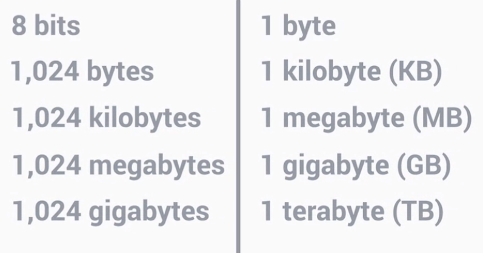
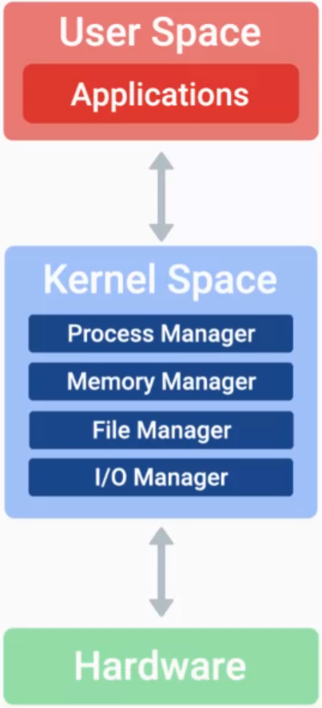

# Suporte de TI

>TI = tecnologia da informação - uso de tecnologia digital para armazenar e processar dados, tornando-os informações utéis.

----------------------------------------------------------------------------------

### História da computação

**Computador:** dispositivo que armazena e processa dados, executando cálculos.

**Ábaco:** um dos primeiros computadores inventados para contar números grandes.

**Calculadora mecânica:** Blaise Pascal: séc. XVII, engrenagens para fazer cálculos automáticos.

**Máquina diferencial:** Babbage: versão sofisticada da calculadora mecânica, também fez **Máquina analitíca**, se inspirou nos cartões perfurados para fazer cálculos automaticamente.
- a partir disso **Ada Lovelace** pensou nos algoritmos para melhorar esse processo.

**Alan Turing - Máquina enigma** - ajudou os aliados a decodificar mensagens na segunda guerra.

----------------------------------------------------------------

### Linguagem dos computadores

-> Sistema binário: sistema de base dois, 0 ou 1.
- Circuitos lógicos: permitem que nossos transistores façam tarefas mais complexas.

-> Codificação de caracteres: é usada para atribuir valores binários a caracteres que possamos ler e entender na nossa linguagem.

#### Como contar em binário

- Essa imagem representa o número dez, contamos os que estão "ligados", ou seja, aqueles que contém o número 1.

----------------------------------------------------------------

### Camadas da arquitetura dos computadores

-> Abstração: tomar um sistema relativamente complexo e simplificá-lo para nosso uso.

----------------------------------------------------------------

### HARDWARE

Portas: pontos de conexão aos quais podemos conectr dispositivos para ampliar a funcionalidade do computador.

CPU: Central Processing Unit: cérebro do computador, faz todos os cálculos e processamento de dados.

RAM: Randow Acces Memory: memória de curto prazo do computado.

HD: Hard Drive: Disco Rigido - guarda todos os dados definitivamente.

Mother Board: Placa Mãe: sistema que conecta todas as peças.

Fonte de alimentação: converte a eletricidade da tomada para um formato que o computador pode usar.

----------------------------------------------------------------

**Programas:** são instruções básicas que dizem ao computador o que ele deve fazer.

-> Barramento de dados externos - EDB: fileira de fios que interconectam as peças do computador e transportam dados binários.

-> Registradores: permitem armazenas os dados com os quais a cpu trabalha, cada um guarda uma informação

-> Memory Controller Chip: ponte entre a CPU e a RAM, encontra as infos na ram e envia para a cpu pelo edb

-> Adress Bus - Barramento de Endereços: conecta o mcc a cpu, envia os endereços que a cpu precisa para o mcc que retorna os dados

-> Cache: dados que usamos com frequencia

-> Clock: cada tensão no fio clock é um aviso que a cpu recebe dizendo que pode realizar seus calculos, como um relogio, para cada tique ela realiza operações
> clock speed: quando você vê na loja 3.4ghz, este número refere-se a velocidade do clock na cpu, é o número máximo de ciclos de clock que ela consegue suportar em conjunto em determinado período de tempo. 3.40 gigahertz equivale a 3,4 bilhões de ciclos por segundo.

----------------------------------------------------------------
### Componentes

**CPU:**  
calculadora dentro do computador que processa o binário.  Existem atualmente dois tipos principais de soquetes para CPUs:
- LGA - Land grid array: pinos localizados na placa mãe
- PGA - Pin grid array: pinos estão no processador

**RAM:**  
comumente encontrada nos computadores é a DRAM ou memória de acesso aleatório dinâmica, também existem diferentes tipos de pentes de memória em que os chips DRAM podem ser colocados, mais modernos: DIMM, que significa Dual Inline Memory Module, têm diferentes tamanhos de pinos. 
> Nos sistemas de hoje, usamos outro tipo de RAM, chamado de SDRAM de taxa de dados dupla, ou DDR SDRAM, Houve muitas iterações da DDR, como DDR1, DDR2, DDR3, DDR4. A DDR é mais rápida, consome menos energia e tem uma capacidade maior do que as versões anteriores de SDRAM

**Placa mãe:** 
- chipset: composto por dois chips. Um é chamado de ponte norte, que interconecta itens como a RAM e as placas de vídeo. O outro chip é a ponte sul, que mantém nossos controladores de entrada e de saída, como discos rígidos e dispositivos USB que enviam e recebem dados. Em processadores modernos, a ponte norte é diretamente integrada ao processador, ou seja, não é um chipset de ponte norte separado.  

**Armazenamento:** 

HD: usam um prato giratório e um braço mecânico para ler e gravar informações. A velocidade em que o prato gira permite ler e gravar dados mais rapidamente. É o que se chama geralmente de RPM, ou, rotação por minuto. Um disco rígido com maior RPM é mais rápido.

Existem algumas interfaces que as unidades rígidas usam para se conectar ao nosso sistema.: SATA (cabo que liga Hd na placa) NVM Express, ou NVMe (slot de expansão)

**Fonte de alimentação:**  
Os computadores têm uma fonte de alimentação que converte a eletricidade da tensão de entrada para a tensão que ele usa.

existem dois tipos de eletricidade, a DC, ou corrente contínua, que corre em uma direção, e a AC, ou corrente alternada, que muda de direção constantemente. Nossos computadores usam a tensão DC, então temos de converter a tensão AC da concessionária de energia para algo que podemos usar. Isso é o que a fonte de alimentação faz.

- Tensão: ligue um aparelho de 120 volts em uma tomada de 220 volts, a energia vem com tudo queima seu aparelho. Se fosse o contrário, e um aparelho de 220 volts fosse ligado em uma tomada de 120 volts, o resultado teria sido diferente.

- Amperagem:  a quantidade de eletricidade que sai da tomada. A amperagem puxa toda a eletricidade necessária, mas a tesão oferece tudo o que tem

- Potência: a quantidade de volts e amperes de que o dispositivo precisa.

> USB 2.0 tem uma largura de banda de 480Mb/s, o que dá aproximadamente 60MB de transferência de dados por segundo. A USB 3.0 tem uma largura de banda de 5Gb/s, o que dá aproximadamente 640MB/s. 

-------------------------------------------------------------

### Inicializando

**BIOS:**  
é um software que ajuda a inicializar o hardware do computador e que põe o sistema operacional em funcionamento. Nossa placa-mãe armazena a BIOS em um tipo especial de memória chamada de chip de memória somente leitura, ou chip ROM, não é volátil.

Atualmente existe outro componente da BIOS chamado de UEFI, que significa interface unificada de firmware extensível. A UEFI executa a mesma função de iniciar seu computador, como a BIOS tradicional. Mas ele é mais moderno e tem melhor compatibilidade e suporte para os hardwares mais novos. 

Quando você liga um computador, dá para ouvir bipe de vez em quando. Os computadores executam um teste para garantir que todo o hardware está funcionando corretamente. Chamamos isso de autoteste de inicialização, ou POST. É a BIOS que o executa quando você inicializa seu computador.

Há um chip especial na placa-mãe chamado de chip CMOS. Ele armazena dados básicos de inicialização do seu computador, como a data, hora de sua preferência de inicialização. Você pode alterar essas configurações entrando no menu de configuração do CMOS ou da BIOS.

---------------------------

### Sistema Operacional

- Todo o pacote que gerencia os recursos dos computadores e nos permite interagir com eles

**Conexões remotas:** 
- PuTTY: software open source, pra fazer conexões remotas usando protocolos de redes

- mRemoteNG: é um sistema de área de trabalho remota com uma interface de guias para múltiplas conexões simultâneas.

- MobaXterm: é um sistema de acesso remoto criado para Unix, Linux e Windows.

> SSH: O Secure Shell (SSH) é um protocolo de rede que dá aos usuários uma forma segura de acessar um computador por uma rede não segura.  
>
> O Secure Shell (SSH) é uma maneira de conectar duas máquinas remotas com segurança em uma rede não segura.  
>
>Ele pode ser usado para controlar remotamente clientes habilitados para SSH, transferir arquivos deles e gerenciar recursos de rede desses clientes.  
> O OpenSSH é uma versão de código aberto para o gerenciamento de várias plataformas.  
>
> Há muitos clientes SSH compatíveis com o Windows que têm vários recursos para atender a qualquer necessidade, como PuTTY, SecureCRT, SmarTTY, mRemoteNG e MobaXterm.

**Componentes do SO**

**Arquivos:**
- Sitema de arquivos:   
    Microsoft: NTFS

- Armazenamento de dados: 
    Registramos dados no nosso HD na forma de bloco de dados

- Metadados:  
    Informações sobre o arquivo: File extension

**Gerenciamento de processos:**

- Fatia de tempo: intervalo de tempo muito curto que é alocado para um processo rodar no processador

