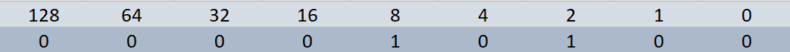

# Suporte de TI

>TI = tecnologia da informação - uso de tecnologia digital para armazenar e processar dados, tornando-os informações utéis.

----------------------------------------------------------------------------------

### História da computação

**Computador:** dispositivo que armazena e processa dados, executando cálculos.

**Ábaco:** um dos primeiros computadores inventados para contar números grandes.

**Calculadora mecânica:** Blaise Pascal: séc. XVII, engrenagens para fazer cálculos automáticos.

**Máquina diferencial:** Babbage: versão sofisticada da calculadora mecânica, também fez **Máquina analitíca**, se inspirou nos cartões perfurados para fazer cálculos automaticamente.
- a partir disso **Ada Lovelace** pensou nos algoritmos para melhorar esse processo.

**Alan Turing - Máquina enigma** - ajudou os aliados a decodificar mensagens na segunda guerra.

----------------------------------------------------------------

### Linguagem dos computadores

-> Sistema binário: sistema de base dois, 0 ou 1.
- Circuitos lógicos: permitem que nossos transistores façam tarefas mais complexas.

-> Codificação de caracteres: é usada para atribuir valores binários a caracteres que possamos ler e entender na nossa linguagem.

#### Como contar em binário

- Essa imagem representa o número dez, contamos os que estão "ligados", ou seja, aqueles que contém o número 1.

----------------------------------------------------------------

### Camadas da arquitetura dos computadores

-> Abstração: tomar um sistema relativamente complexo e simplificá-lo para nosso uso.

----------------------------------------------------------------

### HARDWARE

Portas: pontos de conexão aos quais podemos conectr dispositivos para ampliar a funcionalidade do computador.

CPU: Central Processing Unit: cérebro do computador, faz todos os cálculos e processamento de dados.

RAM: Randow Acces Memory: memória de curto prazo do computado.

HD: Hard Drive: Disco Rigido - guarda todos os dados definitivamente.

Mother Board: Placa Mãe: sistema que conecta todas as peças.

Fonte de alimentação: converte a eletricidade da tomada para um formato que o computador pode usar.

----------------------------------------------------------------